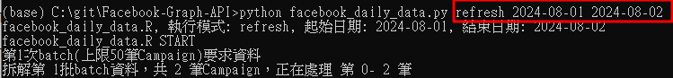

# Facebook-Graph-API
Connects to the Facebook Graph API to retrieve detailed information from Facebook campaigns and writes it into a MySQL database.

### 專案簡介 | Project Overview
接收 Facebook Graph API 資料並處理後寫入資料庫，程式會處理一些例外狀況、紀錄及錯誤通知。
This project retrieves data from the Facebook Graph API, processes it, and writes the results to a database. It includes exception handling, logging, and error notification.

### 主要目的 | Main Purpose
每日記錄各 campaign 的詳細資訊，方便製作圖表、看板統計、數據分析及進行機器學習。
Provides daily records of each campaign’s details for visualizations, dashboards, statistical reports, and machine learning analysis.

### 運行指導 | Usage
1. **配置資料庫與通知設定**  
   **Database & Notification Setup**: Enter database and email settings in `all_setting.json`.
   
2. **Facebook 設定**  
   **Facebook Configuration**: Add Facebook user, account token, and campaign details in `facebook_setting.yml`.
   
3. **執行主程式**  
   **Run the Main Script**: Execute `facebook_daily_data.py` in the command line, specifying mode, start date, and end date as parameters.
   

### 輸出結果 | Output Results
- 生成 CSV 文件，包含每個 campaign 的詳細數據
- `Log` 資料夾記錄每天執行結果的文本文件
Generates a CSV file for each campaign and logs execution results in a daily text file in the `Log` folder.

### 各檔案描述 | File Descriptions
- **all_setting.json**  
  資料庫與信箱設定檔案。  
  *Database and email configuration file.*
- **facebook_setting.yml**  
  Facebook 帳號與 campaign 的設定檔。  
  *Facebook account and campaign configuration file.*
- **facebook_daily_data.py**  
  主程式，包含以下功能：
  - 設定讀取
  - 日誌設定
  - 連接資料庫並寫入資料
  - API 串接與特殊情況處理 (翻頁、失敗重連、campaign 最多串接數限制)
  - 數據整合與通知
  *Main script with the following functionalities:*
  - Reads settings
  - Configures logging
  - Connects to and writes to the database
  - API connection and special case handling (pagination, retries, campaign link limits)
  - Data integration and notifications
- **facebook_config.py**  
  設定讀取程式，供 `facebook_daily_data.py` 使用。  
  *Configuration loader used by `facebook_daily_data.py`.*
- **facebook_daily_data_fn.py**  
  處理重複性數據格式，用於 `facebook_daily_data.py`。  
  *Handles recurring data formatting, used by `facebook_daily_data.py`.*
